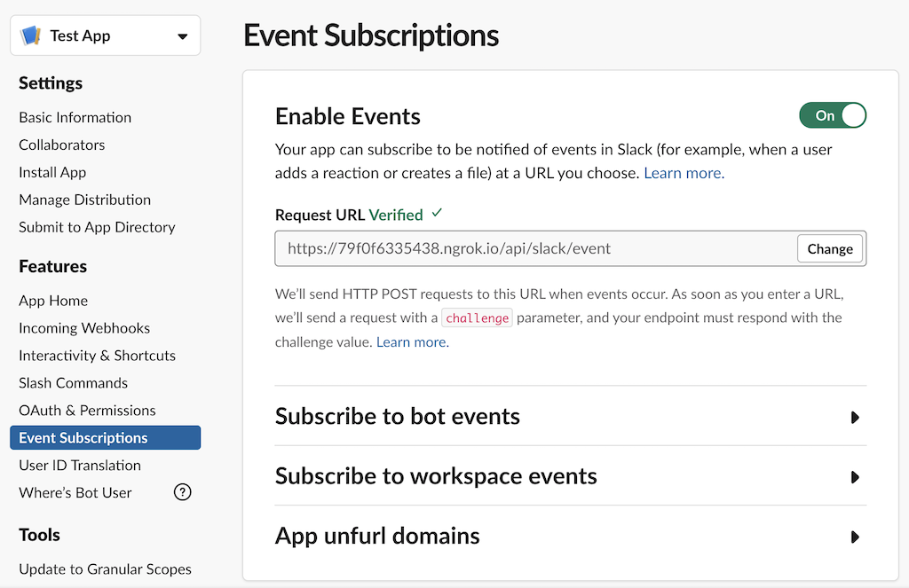
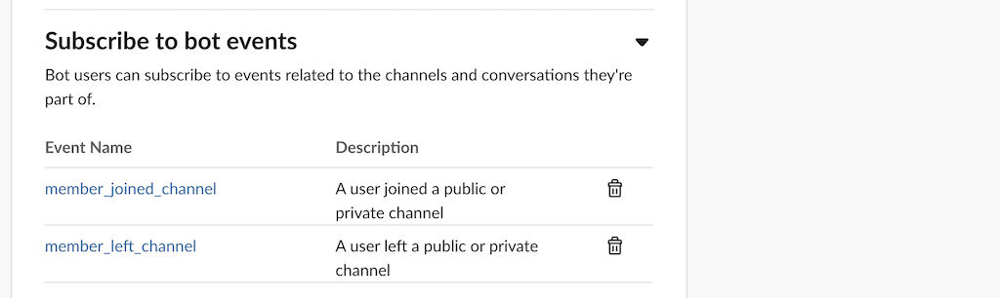
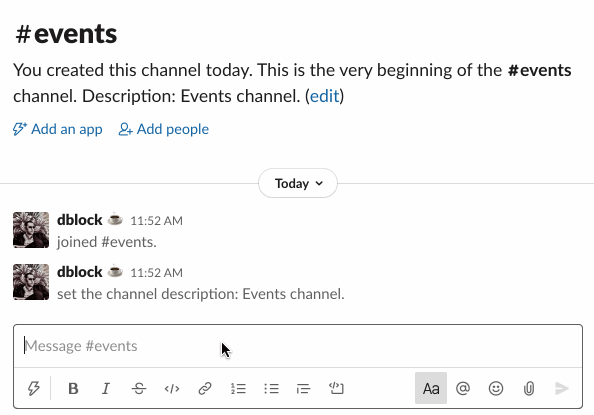

Slack Ruby Bot Server Events Sample
===================================

[](https://travis-ci.org/slack-ruby/slack-ruby-bot-server-events-sample)

### What is this?

A sample app based on [slack-ruby-bot-server-sample](https://github.com/slack-ruby/slack-ruby-bot-server-sample) that implements and responds to [Slack Events API](https://api.slack.com/events-api), [Interactive Message Buttons](https://api.slack.com/legacy/message-buttons) and [Slash Commands](https://api.slack.com/interactivity/slash-commands) using the [slack-ruby-bot-server-events](https://github.com/slack-ruby/slack-ruby-bot-server-events) extension.

### Running the Sample

#### Get Settings

Create `.env` file with the following settings.

```
SLACK_CLIENT_ID=...
SLACK_CLIENT_SECRET=...
SLACK_OAUTH_SCOPE=bot,commands
SLACK_SIGNING_SECRET=...
```

Get your signing secret from [your app's](https://api.slack.com/apps) _Basic Information_ settings.

Run `bundle install` and `foreman start`.

#### Install App

Register your app via OAuth workflow from [localhost:5000](http://localhost:5000).

#### Configure Events

Expose the local server port 5000 to receive Slack events using [ngrok]().

```
ngrok http 5000
```

Copy the URL, e.g. `https://79f0f6335438.ngrok.io` and use it as _Request Url_ in your app's Features under _Event Subscriptions_, e.g. `https://79f0f6335438.ngrok.io/api/slack/event`. When you change this URL, Slack will `POST` a verification challenge to `/api/slack/event`, which should succeed.



#### Subscribe to Events

Subscribe to `member_joined_channel` and `member_left_channel` events.



#### Try It

Invite the bot to a channel. Add/remove some other members. The welcome message is [posted from lib/events/member_joined_channel.rb](lib/events/member_joined_channel.rb) every time a user joins.



A default handler is also fired on all other events in [lib/events/default.rb](lib/events/default.rb) producing log output.

```
11:49:56 web.1  | I, [2020-07-19T11:49:56.933931 #72370]  INFO -- : Successfully connected team dblock (T04KB5WQH) to https://dblockdotorg.slack.com.
11:53:10 web.1  | I, [2020-07-19T11:53:10.607301 #72370]  INFO -- : User test_app joined events.
11:53:17 web.1  | I, [2020-07-19T11:53:17.786968 #72370]  INFO -- : User dblockplayplay joined events.
```

### Copyright & License

Copyright [Daniel Doubrovkine](http://code.dblock.org), 2020

[MIT License](LICENSE)
