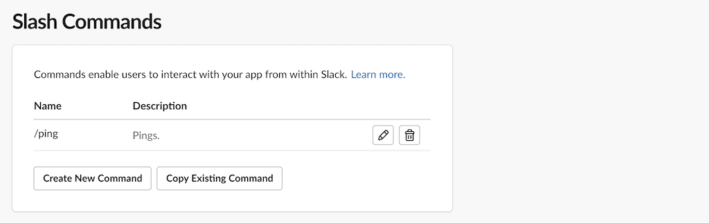
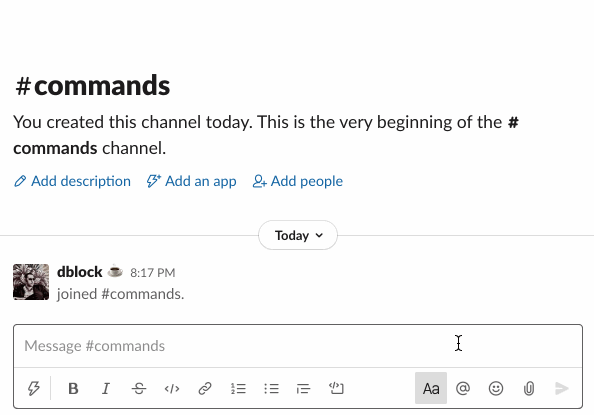
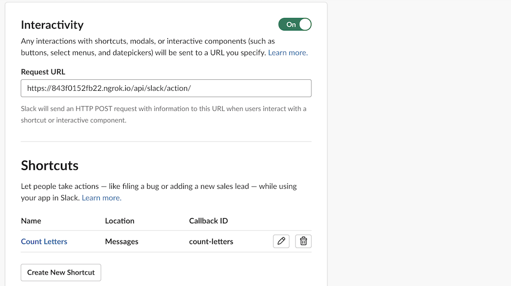
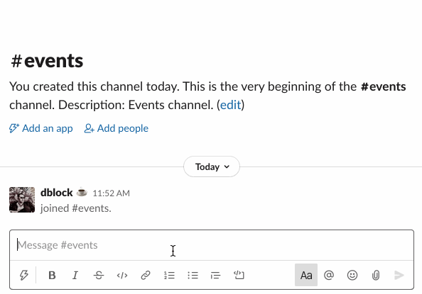

Slack Ruby Bot Server Events Sample
===================================

[](https://travis-ci.org/slack-ruby/slack-ruby-bot-server-events-sample)

## What is this?

A sample app that uses [slack-ruby-bot-server-events](https://github.com/slack-ruby/slack-ruby-bot-server-events) to implement and respond to [Slack Events API](https://api.slack.com/events-api), [Interactive Message Buttons](https://api.slack.com/legacy/message-buttons) and [Slash Commands](https://api.slack.com/interactivity/slash-commands).

## Running the Sample

### Settings

Create `.env` file with the following settings.

```
SLACK_CLIENT_ID=...
SLACK_CLIENT_SECRET=...
SLACK_SIGNING_SECRET=...
SLACK_VERIFICATION_TOKEN=...
```

Get the values from from [your app's](https://api.slack.com/apps) _Basic Information_ settings.

Run `bundle install` and `foreman start`.

### Install App

Register your app via OAuth workflow from [localhost:5000](http://localhost:5000).

Expose the local server port 5000 to receive Slack events using [ngrok](https://ngrok.com).

```
ngrok http 5000
```

Copy the URL, e.g. `https://79f0f6335438.ngrok.io`, and use it as the prefix for your events, slash commands, and interactive message buttons.

### OAuth Scopes

See [config/initializers/slack-ruby-bot-server.rb](config/initializers/slack-ruby-bot-server.rb) for the required OAuth scopes. If you get `Slack::Web::Api::Errors::MissingScope: missing_scope` errors, you are missing a scope in your app configuration.

### Events

Set the _Request Url_ in your app's Features under _Event Subscriptions_, e.g. `https://79f0f6335438.ngrok.io/api/slack/event`. When you change this URL, Slack will `POST` a verification challenge to `/api/slack/event`, which should succeed.


Subscribe to `member_joined_channel` and `member_left_channel` events.


Invite the bot to a channel. Add/remove some other members. The welcome message is [posted from lib/events/member_joined_channel.rb](lib/events/member_joined_channel.rb) every time a user joins.


A default handler is also fired on all other events in [lib/events/default.rb](lib/events/default.rb) producing log output.

```
11:49:56 web.1  | I, [2020-07-19T11:49:56.933931 #72370]  INFO -- : Successfully connected team dblock (T04KB5WQH) to https://dblockdotorg.slack.com.
11:53:10 web.1  | I, [2020-07-19T11:53:10.607301 #72370]  INFO -- : User test_app joined events.
11:53:17 web.1  | I, [2020-07-19T11:53:17.786968 #72370]  INFO -- : User dblockplayplay joined events.
```

### Slash Commands

Create a `/ping` Slash command.



There's no need to invite the bot to a channel. Try `/ping`, the bot will respond with `pong` from [lib/slash_commands/ping.rb](lib/slash_commands/ping.rb).



A default handler is also fired on all other slash commands in [lib/slash_commands/default.rb](lib/slash_commands/default.rb) producing log output.

```
20:17:02 web.1  | I, [2020-07-19T20:17:02.678409 #77259]  INFO -- : Successfully connected team dblock (T04KB5WQH) to https://dblockdotorg.slack.com.
20:17:05 web.1  | I, [2020-07-19T20:17:05.703699 #77259]  INFO -- : Received a ping.
```

### Actions

Set the _Request Url_ in your app's Features under _Interactivity & Shortcuts_, e.g. `https://79f0f6335438.ngrok.io/api/slack/action`. Create an "on messages" shortcut, set the ID to `count-letters`.



There's no need to invite the bot to a channel. Choose the "Count Letters" shortcut, the bot will respond with an ephemeral message from [lib/actions/count_letters.rb](lib/actions/count_letters.rb).



A default handler is also fired on all other actions in [lib/actions/default.rb](lib/actions/default.rb) producing log output.

```
23:42:21 web.1  | I, [2020-07-19T23:42:21.394965 #78955]  INFO -- : Successfully connected team dblock (T04KB5WQH) to https://dblockdotorg.slack.com.
23:43:43 web.1  | I, [2020-07-19T23:43:43.978877 #78955]  INFO -- : Counting letters in "The red brown fox jumped over a lazy dog."
```

### Copyright & License

Copyright [Daniel Doubrovkine](http://code.dblock.org), 2020

[MIT License](LICENSE)
